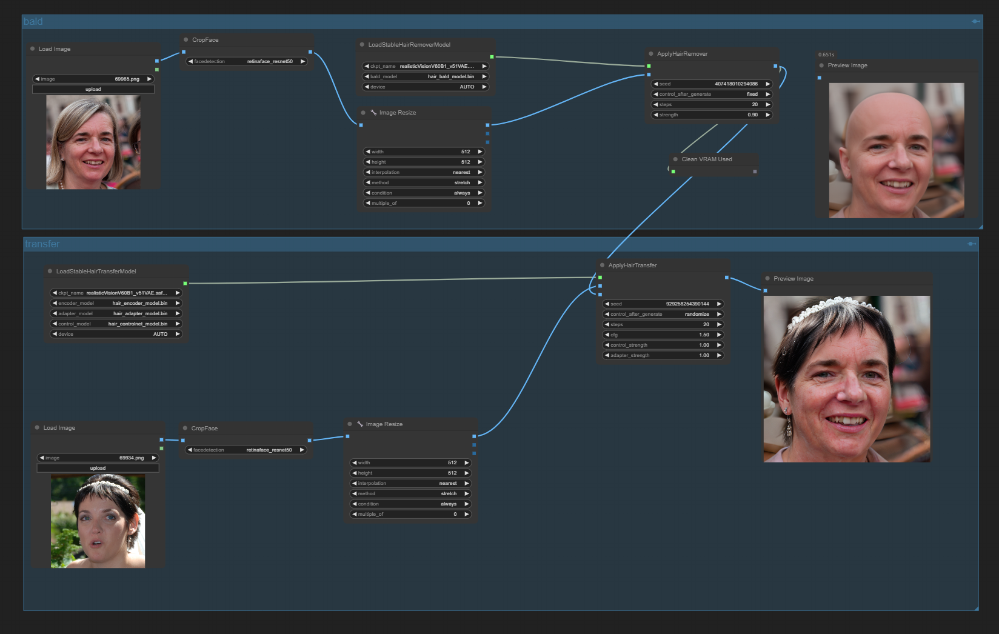

[ENGLISH](README_EN.md)

头发迁移

## 预览


## [示例工作流](example/workflow_base.png)
工作流中是最简单的替换，没有贴回原图，完整的流程是：裁剪包含头发的头像区域->生成光头->迁移参考图像头发->把结果图贴回原图

### 说明：
- 生成光头和迁移头发的图像宽高需要是8的倍数，两个裁剪后的图像尺寸要一致，需要是正面照
- 大模型要选sd1.5模型

## 安装

- 手动安装
```shell
    cd custom_nodes
    git clone https://github.com/lldacing/ComfyUI_StableHair_ll.git
    cd ComfyUI_StableHair_ll
    # 重启comfyUI
```
    

## 模型
从[HuggingFace](https://huggingface.co/lldacing/StableHair/tree/main)下载所有文件放到目录`ComfyUI/models/diffusers/StableHair`

建议使用huggingface-cli下载
```
# 设置代理，按需设置，也可开全局代理
set https_proxy=http://127.0.0.1:7890
# 在ComfyUI/models/diffusers/目录下启动命令行执行下面的命令，如果找不到huggingface-cli，huggingface-cli在${python_home}/Scripts目录下，使用全路径
huggingface-cli download lldacing/StableHair --local-dir StableHair
```
目录结构如下：
```
ComfyUI
  └─models
      └─diffusers
          └─StableHair
              └─hair_encoder_model.bin
              └─hair_adapter_model.bin
              └─hair_controlnet_model.bin
              └─hair_bald_model.bin
```

## 感谢

原项目 [Xiaojiu-z/Stable-Hair](https://github.com/Xiaojiu-z/Stable-Hair)

